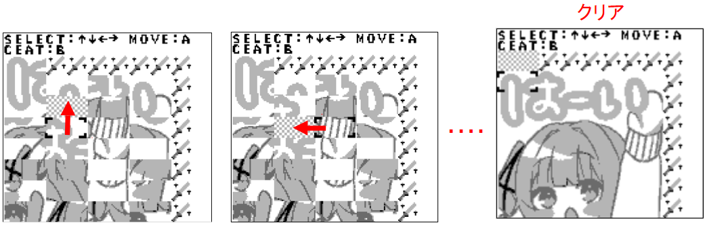

# GBましろん
GBましろんは、VTuber[黒岡ましろ](https://twitter.com/kurokamashiro)さんを題材にした、無印ゲームボーイ向けの最新ゲームです。

  

## プレイ準備
GBましろんはゲームボーイの実行形式であるgbファイルとして配布しています。プレイするにはゲームボーイのエミュレーションソフトが必要です。
以下の手順でプレイ環境を構築できます。

1. [GBましろんのgbファイル](https://github.com/maoh-ika/msrn/blob/main/dist/Release/msrn.gb)をPCに保存します。リンク先ページの右側にあるダウンロードアイコンをクリックしてください。
2. [ゲームボーイのエミュレーションソフト](https://www.mesen.ca/)をダウンロードします。リンク先はMesenというソフトですが、無印ゲームボーイに対応していればどれを使っても良いです。
3. ダウンロードしたMesenを起動し、Fileメニューから1でダウンロードしたgbファイルを開けばゲームが開始します。

## あそびかた
GBましろんには、スライドパズルゲームをプレイできるパズルモードと、クリアしたパズルのイラストを見ることができるギャラリーモードがあります。

「はじめる」を選択するとパズルモード、「ギャラリー」を選択するとギャラリーモードが開始します。

## 基本ルール
パズルモードはスライド式絵合わせゲームです。1つのイラストを横4マス縦7マスのピースに分割し、ランダムにシャッフルした状態で始まります。
パズルには1つだけ空いたマスがあり、そこにピースを移動せていくことで元のイラストを復元できればクリアになります。

  
  

