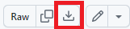
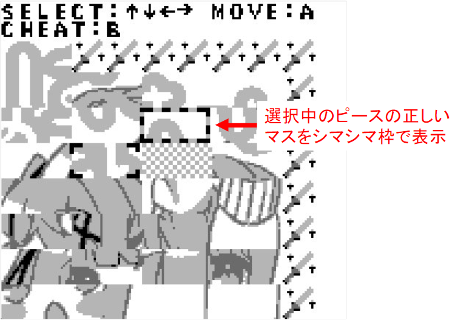

# GBましろん
GBましろんは、VTuber[黒岡ましろ](https://twitter.com/kurokamashiro)さんを題材にした、無印ゲームボーイ向けの最新ゲームです。  

  

## プレイ準備
GBましろんはゲームボーイの実行形式であるgbファイルとして配布しています。プレイするにはゲームボーイのエミュレーションソフトが必要です。
以下の手順でプレイ環境を構築できます。  

1. [GBましろんのgbファイル(msrn.gb)](https://github.com/maoh-ika/msrn/blob/main/dist/Release/msrn.gb)をPCに保存します。リンク先ページの右側にあるダウンロードアイコンをクリックしてください。
2. [ゲームボーイのエミュレーションソフト](https://www.mesen.ca/)をダウンロードします。Windowsなら「Windows(Dev Build)」と書いてある方です。リンク先はMesenというソフトですが、無印ゲームボーイに対応していればどれを使っても良いです。
3. ダウンロードしたMesenを起動し、下の図のとおり設定を変更します。（実行するゲームの機種をGameBoyに変更）
* メニューのSettings→Game Boyを選択  
]  
* Modelを「Game Boy」に変更  
]
5. Fileメニューから1でダウンロードしたgbファイルを開けばゲームが開始します。

## あそびかた
スライドパズルゲームをプレイできるパズルモードと、クリアしたパズルのイラストを見ることができるギャラリーモードがあります。

「はじめる」を選択するとパズルモード、「ギャラリー」を選択するとギャラリーモードが開始します。

### 基本ルール
パズルモードはスライド式絵合わせゲームです。1つのイラストを横4マス縦7マスのピースに分割し、ランダムにシャッフルした状態で始まります。
パズルには1つだけ空いたマスがあり、そこにピースを移動させていくことで元のイラストを復元できればクリアになります。

  
  

  

### キー操作
* ↑、↓、←、→キー：空白マスを中心として、それぞれ上、下、左、右のピースを選択します。
* Ａボタン：選択したピースを空白マスに移動させます。
* Ｂボタン：押している間、チートモードになります。
* Ｂボタンを押しながらスタートボタン：すべてのピースを自動で正しい位置へ移動させ、強制的にクリアします。ギャラリーモードのアンロックだけをしたい場合に使います。

### チートモード
チートモードを有効にすると、選択中のピースの正しい配置マスが表示されます。チートモードで表示された正解マスを目指してピースを移動させていくとクリアできます。  

